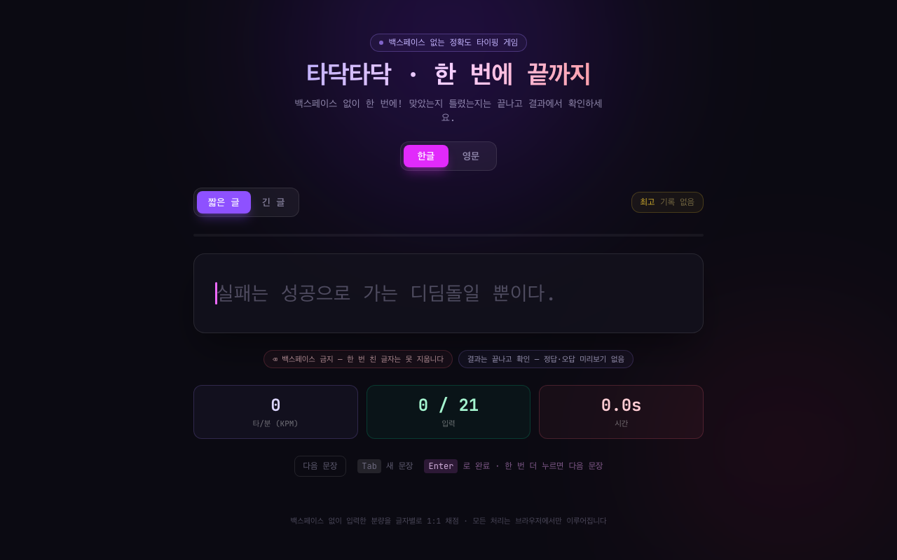

# 타닥타닥 · 백스페이스 없는 정확도 타이핑 게임

> **백스페이스 없이 한 번에!** 친 글자는 되돌릴 수 없고, 타이핑 중에는 정답·오답을 알 수 없습니다. 결과는 끝나고 확인하는 한글·영문 타이핑 게임 — 자모(초성·중성·종성)를 분해해 **실제 타건수(KPM)**를 정확히 측정합니다.


## 🔗 라이브 데모

**[https://hangul-typing-test.vercel.app](https://hangul-typing-test.vercel.app)**



## ✨ 주요 기능

- 🚫 **백스페이스 금지 (append-only)** — 한 번 친 글자는 절대 지울 수 없습니다. 확정된 입력 길이(`lockedLength`)를 기록해, 그 아래로 줄이려는 모든 시도(Backspace/Delete, IME 자모 삭제)를 무력화합니다.
- 🙈 **타이핑 중 정답·오답 비공개** — 입력하는 동안에는 맞았는지 틀렸는지 색상 피드백이 전혀 없습니다. 지문은 중립 색으로만 보이고 현재 위치는 깜빡이는 커서로만 표시됩니다. 채점은 **끝나고 결과 화면에서만** 공개됩니다.
- 🎯 **정확한 정확도 채점** — 친 각 글자 `typed[i]` 를 지문의 같은 위치 `target[i]` 와 코드포인트(`Array.from`) 단위로 1:1 비교합니다. `정확도 = 맞은 글자 수 / 친 글자 수`. 한 글자만 정확히 치고 엔터를 누르면 **정확도 100% · 오타 0개**가 정확히 나옵니다. (조합 중간 상태가 오타로 잘못 집계되지 않습니다.)
- 🌐 **한글 / 영문 모드** — 언어 토글로 한국어·영어 연습을 전환합니다. 한글은 **KPM(타/분)**, 영문은 **WPM(단어/분)**을 주지표로 보여줍니다.
- ⌨️ **실시간 속도·진행 표시** — 따라 치는 즉시 주지표(KPM/WPM)·입력량·경과 시간이 갱신됩니다. (정확도는 게임 규칙상 끝까지 비공개)
- 🧩 **정확한 한글 타건수 계산** — 완성형 한글을 유니코드 기준으로 초성·중성·종성으로 분해하고, 받침 유무와 복합 자모(ㅘ, ㄳ 등)까지 반영해 **실제 키보드 타건수**로 계산합니다. (단순 글자수가 아님)
- 🇰🇷 **한글 IME 조합 입력 처리** — `compositionstart` / `compositionend`로 조합 중인 글자를 안전하게 다뤄, 조합 중간(미확정) 상태가 오타로 오판되지 않게 하고, 확정된 글자만 채점·잠금 대상으로 삼습니다.
- 📚 **랜덤 지문 풀** — 한국어·영어 명언·문장을 랜덤으로 제공하고, `Tab` 키 또는 버튼으로 다음 문장을 받을 수 있습니다.
- ⏎ **엔터로 완료 / 다음** — 한 글자라도 친 상태라면 `Enter`로 측정을 즉시 종료합니다. 지문을 끝까지 치지 않았어도 그 시점까지 친 분량을 기준으로 결과가 확정됩니다. 결과 화면에서 한 번 더 누르면 다음 문장으로 넘어갑니다. 한글 IME 조합 중인 엔터는 무시합니다.
- 📝 **짧은 글 / 긴 글 모드** — 난이도와 분량을 골라 연습할 수 있습니다.
- 🏆 **결과 리포트** — KPM / WPM / CPM(글자/분) / 정확도 / 걸린 시간 + 어디를 틀렸는지 글자별 하이라이트를 한눈에.
- 💾 **최고 기록 저장** — `localStorage`에 언어·길이별 최고 기록을 저장해 갱신 시 알려줍니다.

## 🧮 한글 타수 계산 방식

```
완성형 한글 (가 ~ 힣, U+AC00 ~ U+D7A3)
  → (글자코드 - 0xAC00) 로 오프셋 계산
  → 종성 = offset % 28
  → 중성 = (offset % 588) / 28
  → 초성 = offset / 588

타건수 = 초성(1타) + 중성(1~2타) + 종성(0~2타)
  · 복합 중성(ㅘ ㅙ ㅚ ㅝ ㅞ ㅟ ㅢ) = 2타
  · 복합 종성(ㄳ ㄵ ㄶ ㄺ … ㅄ) = 2타
영문 / 숫자 / 공백 / 문장부호 = 1타
```

예) `값` = ㄱ(1) + ㅏ(1) + ㅄ(2) = **4타**, `안녕하세요` = 3+3+2+2+2 = **12타** (한컴타자 등 두벌식 실입력 타수 기준과 일치)

> **속도 공식**: `KPM = 타건수 / 경과시간(분)`, `WPM = (글자수 / 5) / 경과시간(분)`.
> 타이머는 첫 입력 시점에 시작되고, 지문을 끝까지 정확히 입력하거나 `Enter`를 누른 시점에 종료됩니다. 결과는 그 시점까지 친 분량 기준으로 산출됩니다.

## 🛠 기술 스택

- **React 19** + **TypeScript**
- **Vite 8** (빌드 / 개발 서버)
- **Tailwind CSS 4** (`@tailwindcss/vite` 플러그인)
- **JetBrains Mono** 모노스페이스 폰트
- 100% 클라이언트 사이드 — 서버 / API 불필요

## 🚀 로컬 실행

```bash
npm install
npm run dev
```

빌드:

```bash
npm run build
npm run preview
```

## ⌨️ 단축키

| 키 | 동작 |
| --- | --- |
| `Tab` | 새 문장으로 교체 |
| `Enter` | (타이핑 중) 측정을 종료하고 결과 확정 — 한글 IME 조합 중에는 무시 |
| `Enter` | (결과 화면) 다음 문장으로 이동 후 새 측정 시작 |
| `Backspace` / `Delete` | **차단됨** — 친 글자는 지울 수 없습니다 |

## 📄 라이선스

MIT
